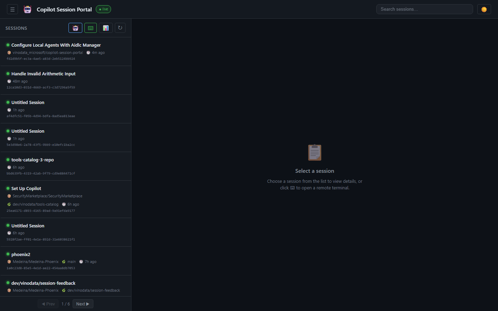
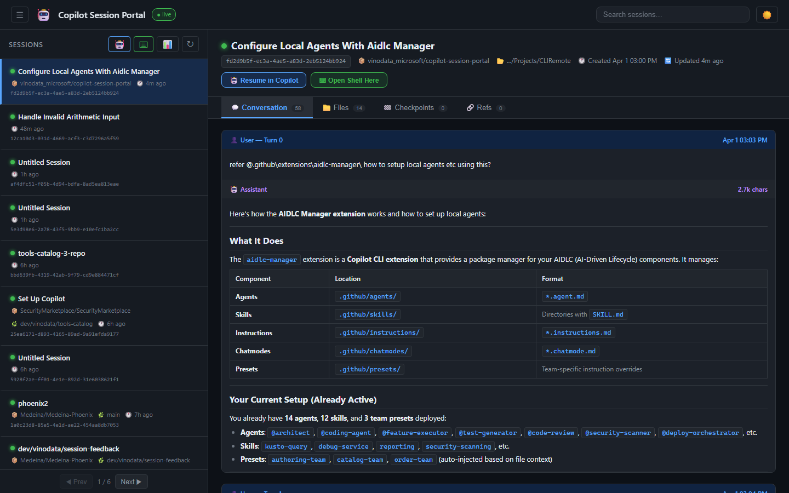
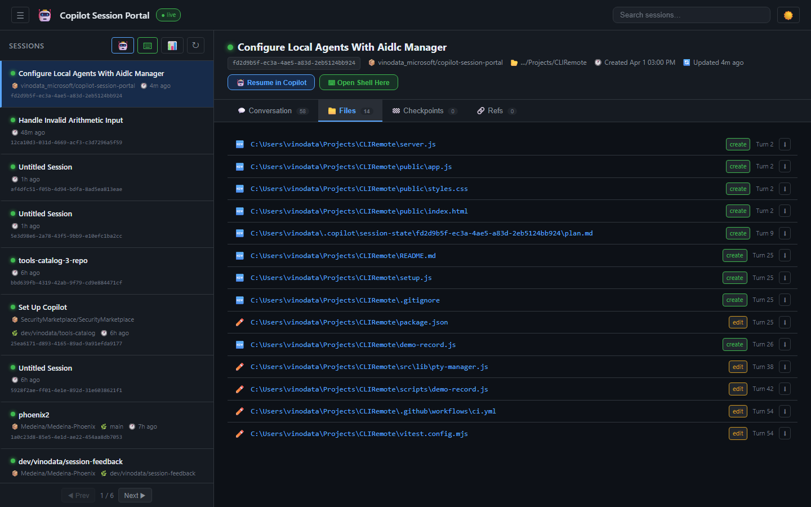
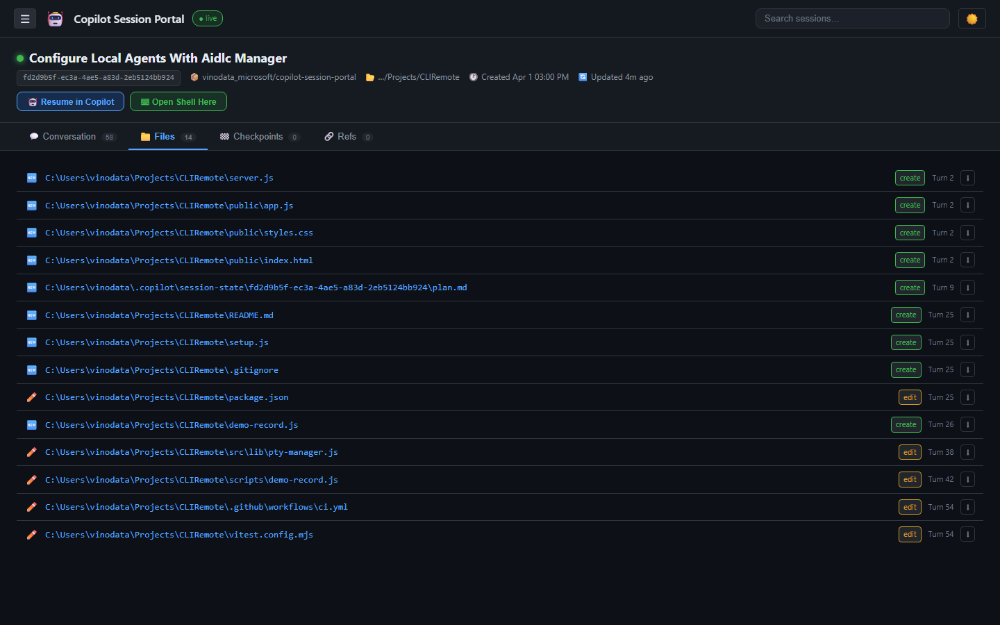
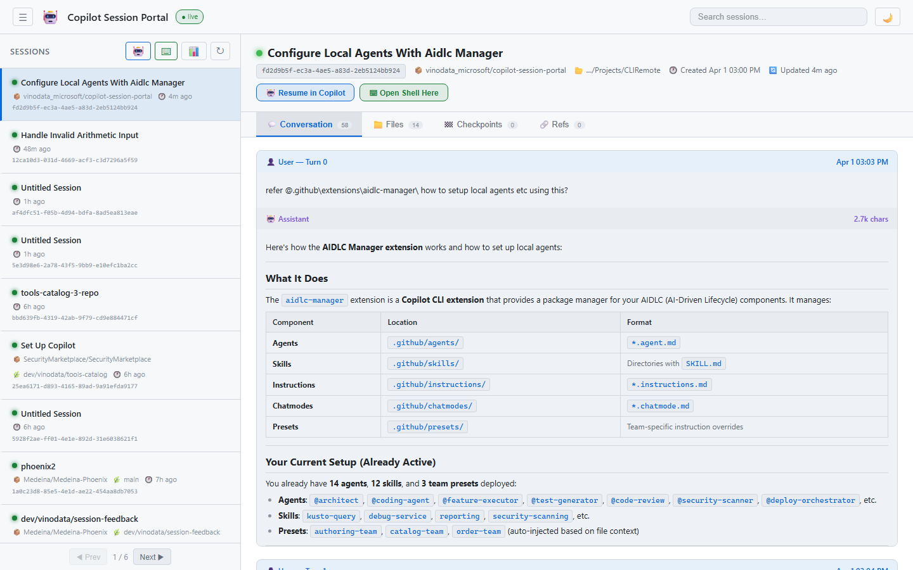
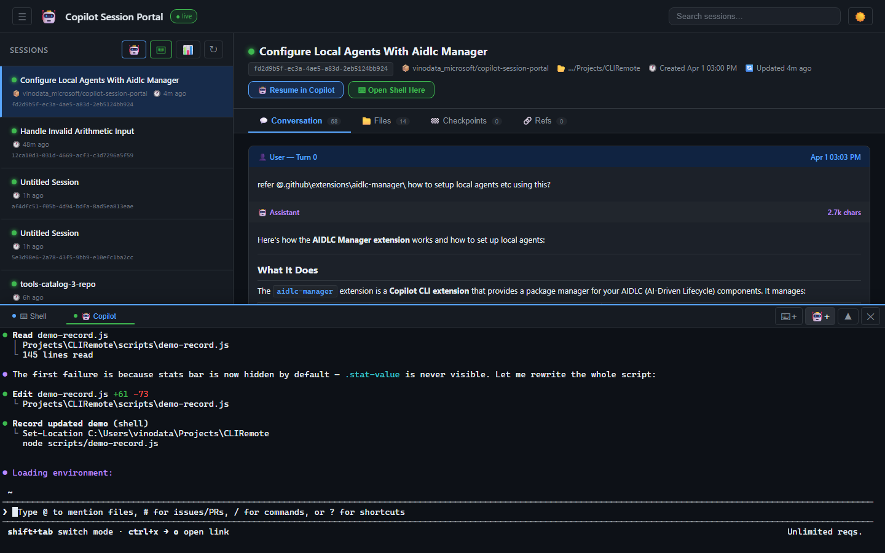
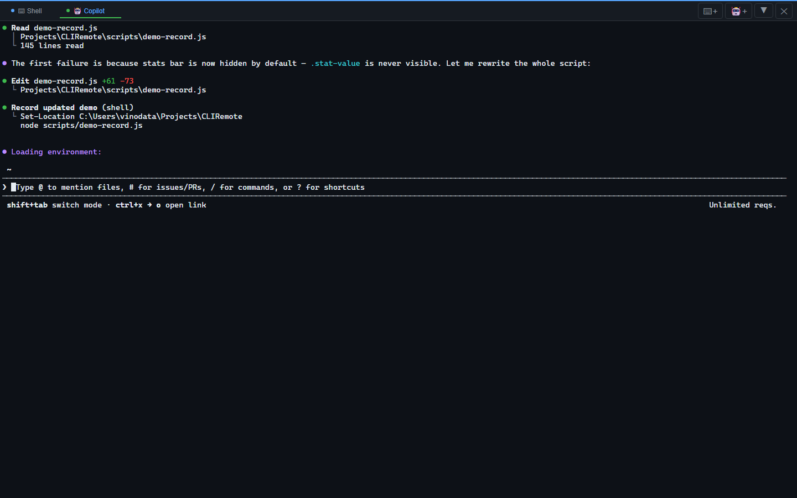

# 🤖 Copilot Session Portal

**Access your GitHub Copilot CLI sessions from any device — phone, tablet, or another PC.**

A self-hosted web portal that lets you browse, monitor, and interact with your Copilot CLI sessions remotely. Launch full Copilot sessions in the browser, resume past conversations, view files with syntax highlighting, and stream live updates — all through a dev tunnel accessible from anywhere.


---

## 📸 Screenshots

### Dashboard


### Session Detail with Markdown Conversation


### Files Tab with Download


### Collapsible Sidebar


### Light Theme


### Multi-Tab Terminal


### Maximized Terminal


### 🎬 Demo Video

> *[Download demo video](docs/demo/demo.webm)*

---

## ✨ Features

| Feature | Description |
|---|---|
| **📊 Session Dashboard** | Browse all 175+ Copilot CLI sessions with search, stats, and pagination |
| **🤖 Remote Copilot** | Launch `copilot --resume=<id>` in a persistent PTY — full TUI in the browser |
| **📱 Any Device** | Access from phone, tablet, or any browser via dev tunnel |
| **🔄 Persistent PTY** | Terminal sessions survive browser disconnect — reconnect anytime |
| **💬 Live Streaming** | Watch active sessions update in real-time via WebSocket |
| **📁 File Viewer** | Click any file to view with syntax highlighting, or download |
| **🏁 Checkpoints** | Browse session checkpoints with markdown-rendered details |
| **🔗 Git Refs** | See commits, PRs, and issues linked to each session |
| **🔍 Full-Text Search** | Search across all session content |

## 🚀 Quick Start (2 minutes)

### Prerequisites

- **Node.js 20+** — [download](https://nodejs.org/)
- **GitHub Copilot CLI** — `winget install GitHub.Copilot` (Windows) or `brew install copilot-cli` (macOS)
- **Copilot CLI authenticated** — run `copilot` once and complete login

### Install & Run

```bash
# Clone the repo
git clone https://github.com/YOUR_USERNAME/copilot-session-portal.git
cd copilot-session-portal

# Install dependencies
npm install

# Start the portal
node server.js
```

Open **http://localhost:3456** — you'll see all your Copilot CLI sessions.

### Remote Access (optional)

To access from other devices, set up a dev tunnel:

```bash
# Install dev tunnel (one-time)
winget install Microsoft.devtunnel   # Windows
# brew install devtunnel             # macOS

# Login (one-time)
devtunnel user login

# Create a persistent named tunnel (one-time)
devtunnel create copilot-portal
devtunnel port create copilot-portal -p 3456

# Start the tunnel (run each time) — requires Microsoft login to access
devtunnel host copilot-portal
```

The tunnel URL is **stable** — bookmark it and reuse every time. By default only **your Microsoft account** can access it.

To allow additional users:
```bash
devtunnel access create copilot-portal --anonymous    # Anyone with URL (NOT recommended)
devtunnel access create copilot-portal --org <org-id>  # Entire AAD org
```

## 📱 Usage

### Browse Sessions
Open the portal → see all your Copilot CLI sessions listed with summaries, repos, branches, and timestamps. Click any session to view its conversation, files, checkpoints, and git refs.

### Launch Copilot Remotely
Two ways to start a remote Copilot session:

1. **🤖 button** (header) → Launches `copilot --continue` — picks up your most recent session
2. **Select a session → "🤖 Resume in Copilot"** → Launches `copilot --resume=<session-id>` in that session's original working directory (preserving all MCPs, agents, and custom instructions)

The Copilot TUI runs fully in the browser — colors, diffs, slash commands, everything works. The PTY persists on the server, so you can:
- Close the browser → PTY keeps running
- Open from another device → reconnect to the same session
- Multiple browsers → all see the same terminal

### View Files
In the **Files** tab, click any file path to view it with syntax highlighting, or click ⬇ to download.

### Live Monitoring
Active sessions stream new conversation turns to the portal every 3 seconds. New turns appear with a 🔴 LIVE badge.

## 🏗️ Architecture

```
┌─────────────────────────────────────────────────────────┐
│  Browser (any device)                                    │
│  ┌─────────────┐ ┌──────────────┐ ┌──────────────────┐  │
│  │ Session List │ │ Conversation │ │ xterm.js Terminal │  │
│  │ + Search     │ │ (Markdown)   │ │ (Copilot TUI)    │  │
│  └──────┬──────┘ └──────┬───────┘ └────────┬─────────┘  │
└─────────┼───────────────┼──────────────────┼────────────┘
          │ REST          │ WebSocket        │ WebSocket
          │               │ /ws              │ /ws/terminal
┌─────────┼───────────────┼──────────────────┼────────────┐
│  Express Server (server.js)                              │
│  ┌──────┴──────┐ ┌──────┴───────┐ ┌────────┴─────────┐  │
│  │ Session API │ │ Live Updates │ │ Persistent PTY    │  │
│  │ (SQLite RO) │ │ (broadcast)  │ │ (node-pty)        │  │
│  └──────┬──────┘ └──────────────┘ └────────┬─────────┘  │
│         │                                   │            │
│  ~/.copilot/session-store.db       copilot --resume=ID   │
└──────────────────────────────────────────────────────────┘
          │                                   │
          │ Dev Tunnel (optional)              │
          └───────── https://xxx.devtunnels.ms ┘
```

### Key Components

| Component | Technology | Purpose |
|---|---|---|
| **Server** | Express + WebSocket | REST API, WebSocket multiplexing, PTY management |
| **Terminal** | node-pty + xterm.js | Persistent pseudo-terminal with scrollback buffer |
| **Session Store** | SQLite (read-only) | Reads `~/.copilot/session-store.db` |
| **Frontend** | Vanilla JS + CSS | GitHub-dark themed SPA, markdown rendering |
| **Markdown** | marked + highlight.js | Syntax-highlighted code blocks, tables, lists |
| **Tunnel** | Microsoft devtunnel | Remote access from any device |

## 📡 API Reference

### REST Endpoints

| Method | Path | Description |
|---|---|---|
| `GET` | `/api/stats` | Dashboard stats (total sessions, turns, files) |
| `GET` | `/api/sessions?search=&limit=&offset=` | List sessions with search/pagination |
| `GET` | `/api/sessions/:id` | Session detail |
| `GET` | `/api/sessions/:id/turns` | Conversation turns |
| `GET` | `/api/sessions/:id/files` | Files touched |
| `GET` | `/api/sessions/:id/checkpoints` | Checkpoints |
| `GET` | `/api/sessions/:id/refs` | Git refs (commits, PRs, issues) |
| `GET` | `/api/active-sessions` | Sessions with active state directories |
| `GET` | `/api/search?q=` | Full-text search across sessions |
| `GET` | `/api/file?path=` | Read file content (syntax-highlighted) |
| `GET` | `/api/file/download?path=` | Download file |
| `GET` | `/api/ptys` | List persistent PTY sessions |
| `POST` | `/api/ptys` | Create PTY (`{ command, sessionId, cwd }`) |
| `DELETE` | `/api/ptys/:id` | Kill a PTY |

### WebSocket Channels

| Path | Purpose |
|---|---|
| `/ws` | Session updates (live turn streaming) |
| `/ws/terminal?ptyId=` | Terminal I/O (connect to persistent PTY) |
| `/ws/chat` | Copilot SDK chat (ACP-based) |

## 🔒 Security

- **AAD-protected by default** — dev tunnel requires Microsoft login (only your account can access)
- **Path allowlist** — file API only reads files under directories you've worked in (session cwds)
- **Prompt length limit** — chat input capped at 100KB
- **PTY isolation** — each terminal is a separate process
- To allow anonymous access, run `devtunnel access create copilot-portal --anonymous` (not recommended for sensitive codebases)

## ⚙️ Configuration

| Environment Variable | Default | Description |
|---|---|---|
| `PORT` | `3456` | Server port |

The portal automatically discovers:
- `~/.copilot/session-store.db` — session history database
- `~/.copilot/session-state/` — active session state directories
- Copilot CLI path — auto-detected from WinGet install location

## 🤝 How It Works with Copilot CLI

| Copilot CLI Feature | Portal Integration |
|---|---|
| `copilot --continue` | 🤖 button resumes most recent session |
| `copilot --resume=<id>` | "Resume in Copilot" on any session card |
| Session persistence | All sessions browsable with full history |
| `--allow-all` | Remote sessions auto-approve tools |
| Working directory | Restored from original session's cwd |

## 📋 Requirements

- **Node.js** ≥ 20.0.0
- **GitHub Copilot CLI** ≥ 1.0.10 (for session resume support)
- **Windows**, **macOS**, or **Linux**
- Active Copilot subscription

## 📄 License

MIT
