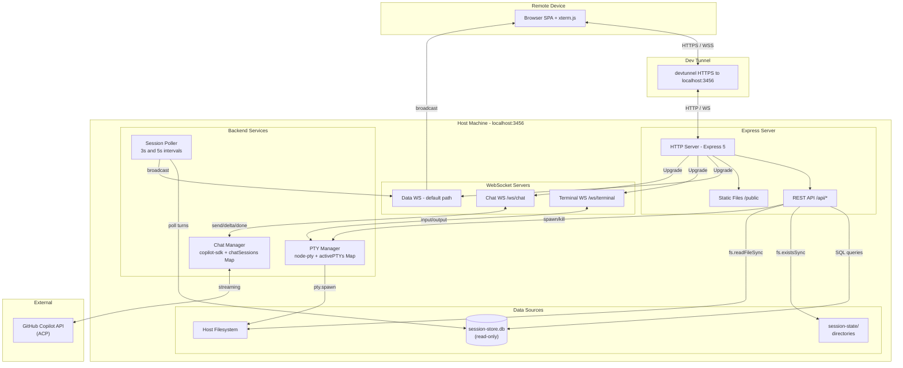
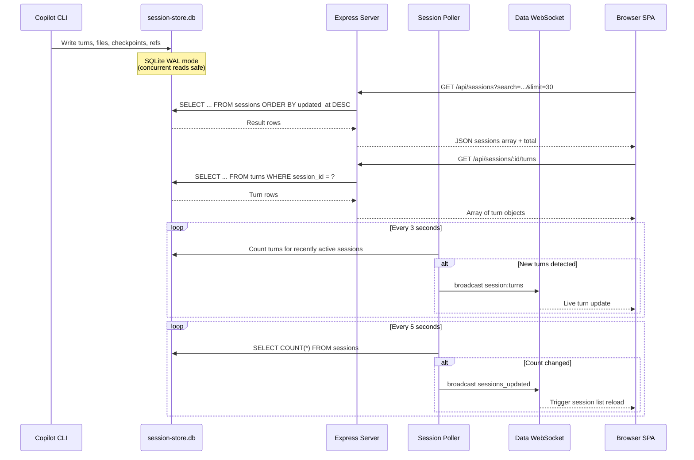
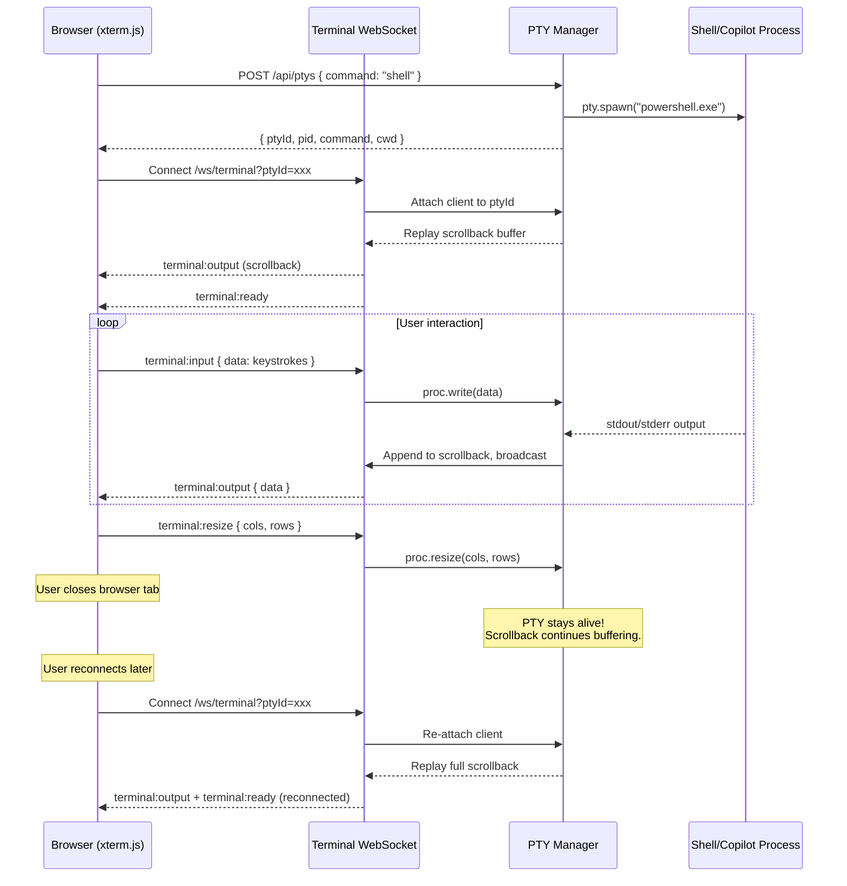
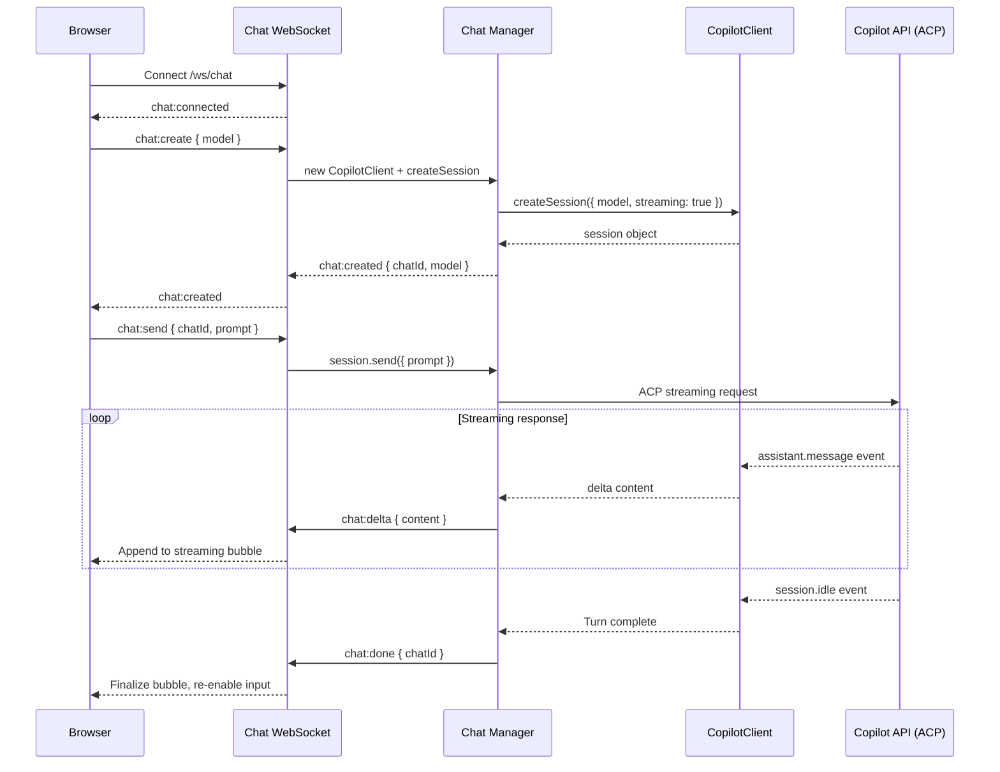

# Copilot Session Portal — Design Document

> **Version**: 1.0  
> **Last Updated**: 2026-04-01  
> **Repository**: CLIRemote

---

## 1. Overview

The **Copilot Session Portal** is a single-page web application that provides a browser-based interface for browsing, monitoring, and interacting with GitHub Copilot CLI sessions remotely from any device. It exposes the Copilot CLI's local SQLite session store through a read-only REST API, multiplexes three WebSocket channels for real-time data, terminal I/O, and programmatic chat, and can be tunneled to the public internet via Microsoft Dev Tunnels for phone/tablet access.

### Problem Statement

GitHub Copilot CLI sessions are local-only: conversation history, file changes, checkpoints, and terminal access are locked to the machine running the CLI. There is no built-in way to:

- Browse past sessions or search across them from another device.
- Watch a running session's conversation stream live.
- Open a remote terminal (or resume a Copilot session) from a phone or tablet.
- Interact with Copilot programmatically (SDK chat) through a browser.

### Solution

A lightweight Node.js server that:

1. Reads the Copilot CLI session store (`~/.copilot/session-store.db`) in read-only mode.
2. Serves a responsive SPA with session browsing, conversation rendering, and file viewing.
3. Provides persistent pseudo-terminal (PTY) sessions via `node-pty` that survive browser disconnects.
4. Offers programmatic Copilot chat via `@github/copilot-sdk` with streaming responses.
5. Tunnels the entire portal through `devtunnel` for remote access.

---

## 2. Architecture

### 2.1 Component Overview

| Component | Technology | Role |
|---|---|---|
| **HTTP Server** | Express 5 on Node.js | REST API + static file serving |
| **Data WebSocket** (`/`) | `ws` library | Broadcasts live session updates to all connected browsers |
| **Terminal WebSocket** (`/ws/terminal`) | `ws` + `node-pty` | Multiplexed PTY I/O — input/output/resize for persistent terminals |
| **Chat WebSocket** (`/ws/chat`) | `ws` + `@github/copilot-sdk` | Streaming Copilot chat relay (ACP protocol) |
| **Session Store** | `better-sqlite3` (read-only) | Queries `~/.copilot/session-store.db` for sessions, turns, files, checkpoints, refs |
| **Session State** | Filesystem (`~/.copilot/session-state/`) | Detects active sessions by directory presence |
| **PTY Manager** | `node-pty` | Spawns and manages persistent shell/copilot processes with scrollback buffers |
| **SPA Client** | Vanilla JS + xterm.js + marked.js + highlight.js | Session browser, conversation viewer, terminal emulator, chat UI |
| **Dev Tunnel** | Microsoft `devtunnel` CLI | Exposes `localhost:3456` to a public HTTPS URL |

### 2.2 Architecture Diagram



### 2.3 WebSocket Path Multiplexing

The server uses a single `http.Server` with `noServer: true` on three `WebSocketServer` instances. The `upgrade` event routes by URL pathname:

| Path | WebSocket Server | Purpose |
|---|---|---|
| `/` (default) | `wss` | Data updates — session count changes, live turn streaming |
| `/ws/terminal` | `termWss` | PTY I/O — connects to persistent or ephemeral terminals |
| `/ws/chat` | `chatWss` | Copilot SDK chat — create sessions, send prompts, receive streaming deltas |

---

## 3. Key Features

### 3.1 Session Browser

- **Paginated list** (30 per page) of all Copilot CLI sessions sorted by last update.
- **Search** across summary, repository, branch, and working directory (debounced, 300ms).
- **Stats bar** showing total sessions, active session-state directories, sessions in last 24h, total turns, and total files touched.
- **Active indicator** — green dot for sessions with a live `session-state/` directory.
- **Auto-refresh** when the data WebSocket broadcasts `sessions_updated`.

### 3.2 Session Detail View

Tabbed interface with four views per session:

| Tab | Data Source | Content |
|---|---|---|
| Conversation | `/api/sessions/:id/turns` | Full conversation with Markdown rendering, syntax-highlighted code blocks, live-appending new turns |
| Files | `/api/sessions/:id/files` | Files created/edited with tool badges, click-to-view, and download buttons |
| Checkpoints | `/api/sessions/:id/checkpoints` | Checkpoint summaries: overview, work done, technical details, important files, next steps |
| Refs | `/api/sessions/:id/refs` | Commits, PRs, issues linked to the session |

### 3.3 Conversation Viewer

- **Markdown rendering** via `marked.js` with GitHub-Flavored Markdown (GFM).
- **Syntax highlighting** via `highlight.js` (github-dark theme) for code blocks.
- **Live streaming** — when viewing an active session, new turns are appended in real-time with a green border and `LIVE` badge. The page auto-scrolls to the latest turn.
- **Truncation** — user messages truncated at 4,000 chars, assistant responses at 8,000 chars to prevent UI lag.

### 3.4 File Viewer

- **Modal overlay** with syntax-highlighted source code (language auto-detected by extension).
- **Binary file handling** — non-text files show a download prompt instead of garbled content.
- **File metadata** — full path, size, extension, last modified timestamp.
- **Download button** — direct file download via `/api/file/download`.
- **5 MB limit** — files larger than 5 MB return HTTP 413.

### 3.5 Persistent Terminal (PTY)

The terminal subsystem is the most architecturally significant feature:

- **Persistent process** — PTY processes (shells or Copilot CLI) are stored server-side in the `activePTYs` Map. Closing the browser tab does **not** kill the process.
- **Scrollback buffer** — up to 50,000 characters of output are buffered. When a client reconnects, the entire buffer is replayed so the user sees the current terminal state.
- **Multi-client** — multiple browser tabs/devices can attach to the same PTY simultaneously. Output is broadcast to all connected clients.
- **Resize support** — `terminal:resize` messages propagate `cols`/`rows` to the PTY process.
- **xterm.js frontend** — full terminal emulation with cursor blink, 256-color support, clickable links (via `WebLinksAddon`), and responsive fitting (via `FitAddon`).
- **Two modes**:
  - **Shell** — spawns `powershell.exe` (Windows) or `$SHELL` (Unix).
  - **Copilot** — spawns `copilot --continue --allow-all` (or `copilot --resume=<session-id>` for a specific session).

### 3.6 Resume in Copilot

Each session detail view has a **"Resume in Copilot"** button that:

1. Calls `POST /api/ptys` with `command: "copilot"` and `sessionId`.
2. The server looks up the session's original `cwd` from the database.
3. Spawns `copilot --resume=<session-id> --allow-all` in that working directory.
4. Opens the terminal overlay connected to the new PTY.

This allows continuing a past Copilot session from any device.

### 3.7 Copilot SDK Chat (ACP)

A separate chat interface that communicates with Copilot programmatically via `@github/copilot-sdk`:

- **Session management** — creates a `CopilotClient` and `session` with streaming enabled and `approveAll` permission handler.
- **Model selection** — dropdown to choose between Claude Sonnet 4, GPT 4.1, Claude Sonnet 4.5, Claude Opus 4.6.
- **Streaming responses** — `assistant.message` events emit `chat:delta` WebSocket messages rendered incrementally in a Markdown bubble.
- **Turn completion** — `session.idle` event signals the response is complete; the full text is stored in history.
- **History persistence** — conversation history is kept in the server's `chatSessions` Map, surviving browser disconnects. Reconnecting clients receive the full history via `chat:joined`.
- **Multi-client** — multiple browsers can observe the same chat session.

### 3.8 Console Input Injection (inject.ps1)

A Windows-specific utility script that uses `kernel32.dll` P/Invoke to inject keyboard input into a running console process by PID. This enables programmatic control of interactive CLI processes.

---

## 4. Data Flow

### 4.1 Session Data Flow



### 4.2 Terminal (PTY) Data Flow



### 4.3 Chat (SDK) Data Flow



---

## 5. API Reference

### 5.1 REST Endpoints

#### Dashboard and Sessions

| Method | Path | Description | Response |
|---|---|---|---|
| `GET` | `/api/stats` | Dashboard statistics | `{ totalSessions, totalTurns, totalFiles, last24h, activeDirs, repos[] }` |
| `GET` | `/api/sessions` | List sessions (paginated, searchable) | `{ sessions[], total }` |
| `GET` | `/api/sessions/:id` | Session detail with counts | Session object + `turnCount, fileCount, checkpointCount, refCount, isActive` |
| `GET` | `/api/sessions/:id/turns` | Conversation turns | `[ { turn_index, user_message, assistant_response, timestamp } ]` |
| `GET` | `/api/sessions/:id/files` | Files touched | `[ { file_path, tool_name, turn_index, first_seen_at } ]` |
| `GET` | `/api/sessions/:id/checkpoints` | Checkpoints | `[ { checkpoint_number, title, overview, work_done, ... } ]` |
| `GET` | `/api/sessions/:id/refs` | Git refs (commits, PRs, issues) | `[ { ref_type, ref_value, turn_index, created_at } ]` |
| `GET` | `/api/active-sessions` | Active session-state directories | `[ { id, cwd, summary, hasLocalDb, hasPlan, lastModified, ... } ]` |
| `GET` | `/api/search?q=...` | Full-text search (FTS5) | `[ { content, session_id, source_type, source_id } ]` |

**Query Parameters for `GET /api/sessions`:**

| Param | Type | Default | Description |
|---|---|---|---|
| `limit` | int | 50 | Max results (capped at 200) |
| `offset` | int | 0 | Pagination offset |
| `search` | string | — | Search term (matches summary, repository, branch, cwd) |

#### File Access

| Method | Path | Description | Response |
|---|---|---|---|
| `GET` | `/api/file?path=...` | Read file content | `{ path, name, ext, size, isText, content, modified }` |
| `GET` | `/api/file/download?path=...` | Download file | Binary stream (Content-Disposition) |

#### Terminal (PTY) Management

| Method | Path | Description | Request / Response |
|---|---|---|---|
| `GET` | `/api/ptys` | List active PTYs | `[ { id, pid, clients, command, cwd, sessionId, createdAt } ]` |
| `POST` | `/api/ptys` | Create persistent PTY | Body: `{ command, sessionId?, cwd?, cols?, rows? }` → `{ ptyId, pid, command, cwd }` |
| `DELETE` | `/api/ptys/:id` | Kill a PTY | `{ ok: true }` |
| `GET` | `/api/terminals` | List terminals (legacy) | `[ { id, pid, clients, command } ]` |

**`POST /api/ptys` command values:**

| Command | Behavior |
|---|---|
| `"copilot"` (default) | Spawns `copilot --continue --allow-all` (or `--resume=<sessionId>` if provided) |
| `"shell"` | Spawns `powershell.exe` (Windows) or `$SHELL` (Unix) |
| Any string | Spawns the given command directly |

#### Chat (SDK) Management

| Method | Path | Description | Request / Response |
|---|---|---|---|
| `GET` | `/api/chat/sessions` | List active chat sessions | `[ { id, model, cwd, createdAt, turns } ]` |
| `POST` | `/api/chat/sessions` | Create chat session | Body: `{ model?, cwd? }` → `{ chatId, model, cwd }` |
| `DELETE` | `/api/chat/sessions/:id` | Delete chat session | `{ ok: true }` |

### 5.2 WebSocket Message Types

#### Data WebSocket (default path `/`)

**Server → Client:**

| Type | Payload | Trigger |
|---|---|---|
| `connected` | `{ ts }` | On initial connection |
| `sessions_updated` | `{ count }` | Session count changed (polled every 5s) |
| `session:turns` | `{ sessionId, turns[], totalTurns }` | New turns detected (polled every 3s) |

#### Terminal WebSocket (`/ws/terminal`)

**Client → Server:**

| Type | Payload | Description |
|---|---|---|
| `terminal:input` | `{ data }` | Keystrokes to write to PTY stdin |
| `terminal:resize` | `{ cols, rows }` | Terminal dimensions changed |

**Server → Client:**

| Type | Payload | Description |
|---|---|---|
| `terminal:ready` | `{ termId, shell, pid, reconnected? }` | PTY attached and ready |
| `terminal:output` | `{ data }` | PTY stdout/stderr output |
| `terminal:exit` | `{ exitCode }` | PTY process exited |

**Connection:** `ws://host/ws/terminal?ptyId=<id>&cols=120&rows=30`
- If `ptyId` matches an existing PTY → reconnect (scrollback replayed).
- If `ptyId` is missing or unknown → ephemeral shell spawned (killed on disconnect).

#### Chat WebSocket (`/ws/chat`)

**Client → Server:**

| Type | Payload | Description |
|---|---|---|
| `chat:create` | `{ model?, cwd? }` | Create a new SDK chat session |
| `chat:join` | `{ chatId }` | Join existing session to receive updates |
| `chat:send` | `{ chatId, prompt }` | Send user message to Copilot |

**Server → Client:**

| Type | Payload | Description |
|---|---|---|
| `chat:connected` | — | WebSocket connected |
| `chat:created` | `{ chatId, model, cwd }` | Chat session created |
| `chat:joined` | `{ chatId, history[] }` | Joined session; history replayed |
| `chat:user` | `{ chatId, content }` | User message echoed to all listeners |
| `chat:delta` | `{ chatId, content }` | Streaming assistant response chunk |
| `chat:done` | `{ chatId }` | Assistant response complete |
| `chat:error` | `{ chatId?, error }` | Error occurred |

---

## 6. Security Considerations

### 6.1 Authentication and Authorization

The portal currently runs with **no authentication**. It inherits the host user's credentials and permissions:

| Resource | Access Level | Risk |
|---|---|---|
| Session store (SQLite) | Read-only via `better-sqlite3` | Low — database opened as `readonly: true` |
| Host filesystem | Full read access via `/api/file` | **High** — any file readable by the server process can be served |
| PTY processes | Full shell access as the server user | **Critical** — equivalent to SSH access |
| Copilot SDK | User's Copilot auth token | **High** — full Copilot access with `approveAll` permissions |

### 6.2 Dev Tunnel Exposure

When exposed via `devtunnel host --allow-anonymous`, the portal is accessible to **anyone with the tunnel URL**:

- **No tunnel auth** — the `--allow-anonymous` flag disables Microsoft identity checks.
- **Full access** — remote users get the same file system, terminal, and Copilot access as the host user.
- **Mitigation** — use `devtunnel host` without `--allow-anonymous` to require Microsoft Entra ID login, or restrict sharing of the tunnel URL.

### 6.3 File Access Controls

The `/api/file` endpoint resolves any path the server process can read:

- A 5 MB size limit prevents accidental memory exhaustion.
- No path allowlist or blocklist is enforced — the endpoint is equivalent to `cat <path>`.
- **Recommendation**: Restrict file access to the session's `cwd` or specific known-safe directories.

### 6.4 PTY Process Permissions

- PTY processes run as the Node.js server's OS user — any command the user can run locally is available.
- Copilot PTYs are spawned with `--allow-all`, which auto-approves all tool calls (file edits, terminal commands, etc.).
- **Recommendation**: For shared/remote use, consider adding an authentication layer or restricting PTY commands.

### 6.5 Input Injection (inject.ps1)

The `inject.ps1` script uses `kernel32.dll` interop to write keyboard events to a foreign process's console input buffer. This:

- Requires `AttachConsole` access to the target PID (same session or elevated privileges).
- Is Windows-only and is not exposed through the web API — it is a standalone utility.

---

## 7. Deployment

### 7.1 Prerequisites

- **Node.js** 18+ (for ESM dynamic `import()` of `@github/copilot-sdk`)
- **GitHub Copilot CLI** installed and authenticated (`copilot auth login`)
- **Microsoft Dev Tunnel CLI** (optional, for remote access)
- **Windows**: Visual Studio Build Tools (for `node-pty` native compilation)

### 7.2 Installation

```bash
cd CLIRemote
npm install
```

> `node-pty` requires native compilation. On Windows, ensure `windows-build-tools` or Visual Studio Build Tools are installed.

### 7.3 Start the Server

```bash
node server.js
```

The server starts on port **3456** (override with `PORT` env var):

```
  ╔══════════════════════════════════════════════╗
  ║  Copilot Session Portal                       ║
  ║  http://localhost:3456                         ║
  ╚══════════════════════════════════════════════╝
  Store: ~/.copilot/session-store.db
  State: ~/.copilot/session-state
```

### 7.4 Remote Access via Dev Tunnel

```bash
# Create a tunnel (first time)
devtunnel create --allow-anonymous

# Forward port 3456
devtunnel port create -p 3456

# Host the tunnel
devtunnel host
```

The tunnel provides an HTTPS URL (e.g., `https://<id>-3456.usw3.devtunnels.ms/`) accessible from any device.

### 7.5 Environment Variables

| Variable | Default | Description |
|---|---|---|
| `PORT` | `3456` | HTTP server listen port |
| `HOME` / `USERPROFILE` | OS default | Used to locate `~/.copilot/session-store.db` |

### 7.6 Dependencies

| Package | Version | Purpose |
|---|---|---|
| `express` | ^5.2.1 | HTTP server and routing |
| `better-sqlite3` | ^12.8.0 | Synchronous SQLite3 driver (read-only) |
| `ws` | ^8.20.0 | WebSocket server (3 instances) |
| `node-pty` | ^1.1.0 | Pseudo-terminal spawning |
| `@github/copilot-sdk` | ^0.2.0 | Programmatic Copilot chat (ACP protocol) |
| `marked` | ^17.0.5 | Markdown parsing |
| `highlight.js` | ^11.11.1 | Syntax highlighting |

### 7.7 Client-Side CDN Dependencies

| Library | Version | Purpose |
|---|---|---|
| xterm.js | 5.5.0 | Terminal emulator |
| xterm-addon-fit | 0.10.0 | Auto-resize terminal to container |
| xterm-addon-web-links | 0.11.0 | Clickable URLs in terminal |
| marked | 12.0.2 | Markdown rendering |
| highlight.js | 11.9.0 | Code syntax highlighting |

---

## 8. Project Structure

```
CLIRemote/
├── server.js            # Express server, WebSocket handlers, PTY/chat managers
├── inject.ps1           # Windows console input injection utility
├── package.json         # Node.js dependencies
├── public/              # Static SPA assets
│   ├── index.html       # Single-page app shell
│   ├── app.js           # Client-side logic (sessions, terminal, chat, file viewer)
│   └── styles.css       # Dark theme (GitHub-inspired design tokens)
└── docs/
    └── design.md        # This document
```

---

## 9. Future Considerations

- **Authentication layer** — add token-based or OAuth auth for remote access security.
- **Session-local SQLite** — read per-session `session-state/<id>/session.db` for richer data (todos, custom tables).
- **Multi-user awareness** — show which clients are connected to a PTY.
- **PTY session persistence** — save/restore PTY sessions across server restarts.
- **Mobile-optimized UI** — responsive layout improvements for small screens.
- **Rate limiting** — protect file and search endpoints from abuse when tunneled.
